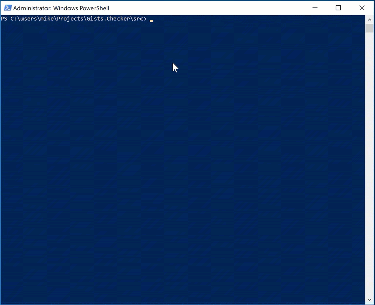
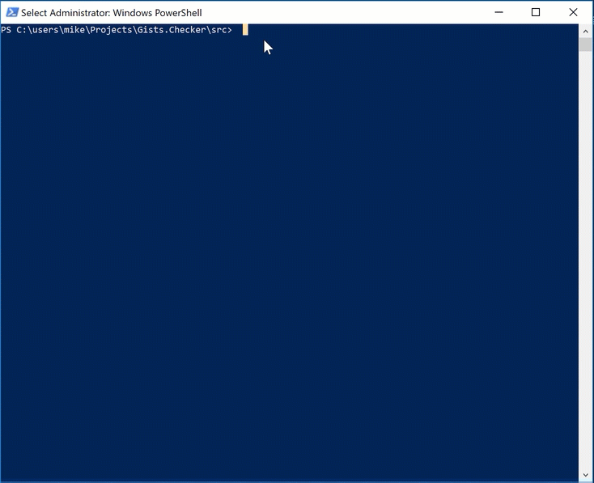

# Gists.Checker
Powershell script to check Gists for a user on GitHub

# How to use
Running the Powershell script is simple, navigate to its directory on the file system via a powershell console and run it as per the example below.

    .\gists-checker.ps1

The list of gists is outputted to the powershell console, this could be changed to output to a file or some other format. In this instance you can copy the gist url and paste it into a browser to see the full output.

# Parameters
There are a couple of parameters / switches you can use to change the default behaviour of the script.

## User

`-user [username]` allows you to set the user whos gists you want to see, if no -user is specified this defaults to my account.

## Interval

`-interval [seconds]` will set the timer to the specified number of seconds, this is the interval which the check for new gists is triggered by. The default is 10.

## Repeat

`-repeat` is a switch, when present the timer will restart and the script will check for new gists until the session is ended. **Note** This script uses the public github api, which has usage limits. If you leave the script running for too long you will exhaust these limits.

### Stopping Repeat loop

Run the unregister script when you want to finish checking for new gists. There is no need to do this if you haven't set the `-repeat` switch.

    .\unregister-gists-checker